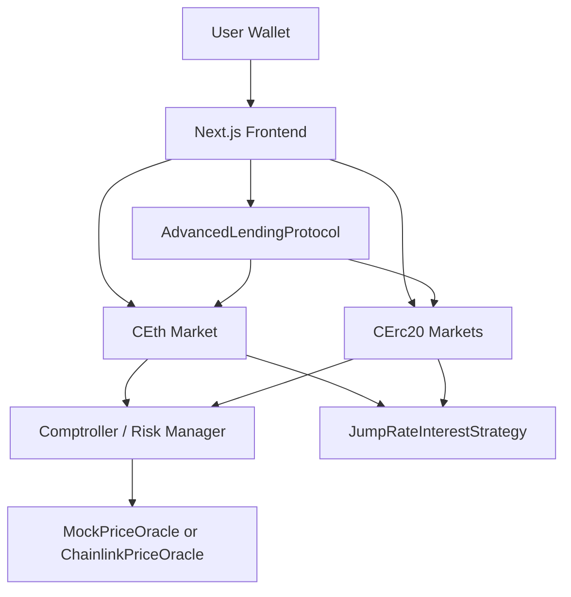
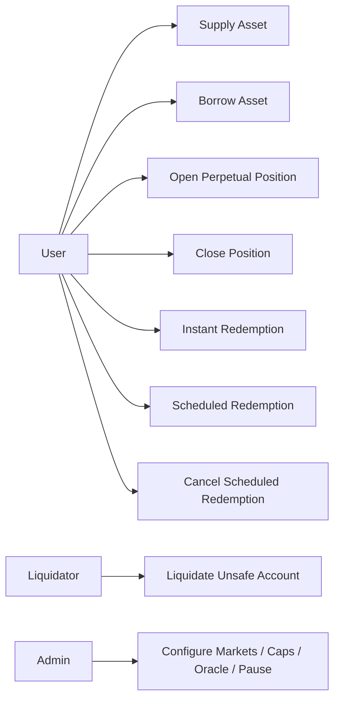
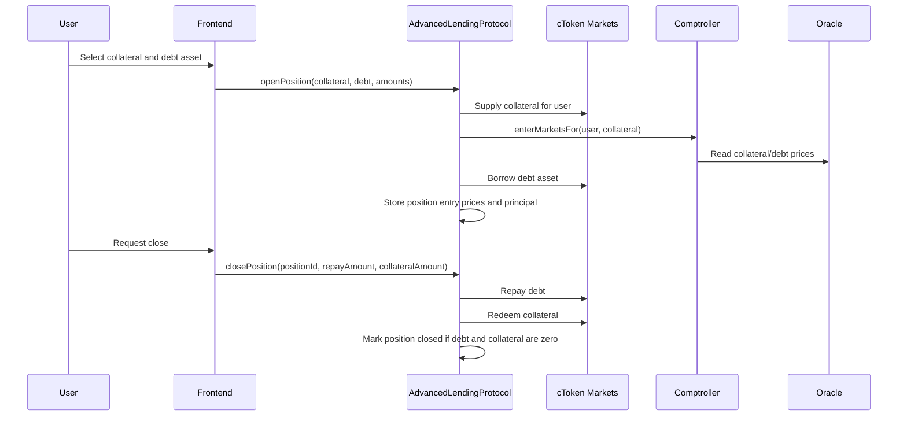
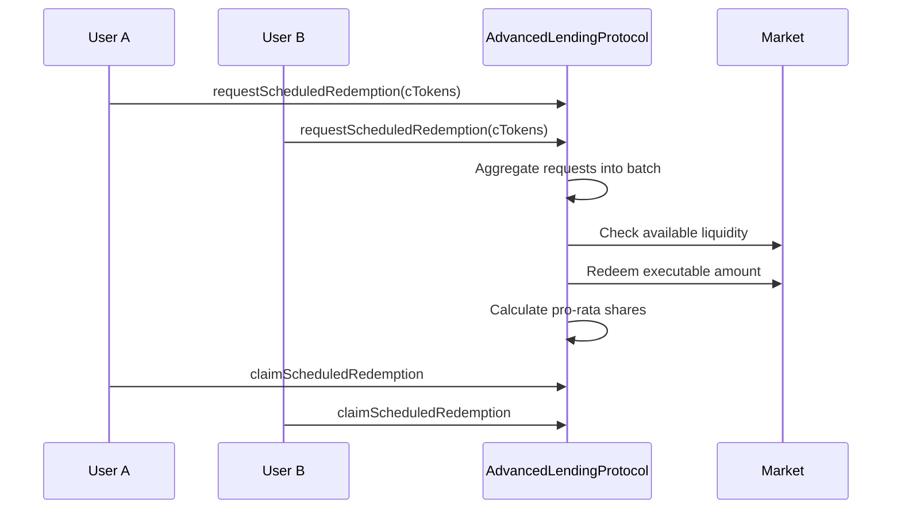
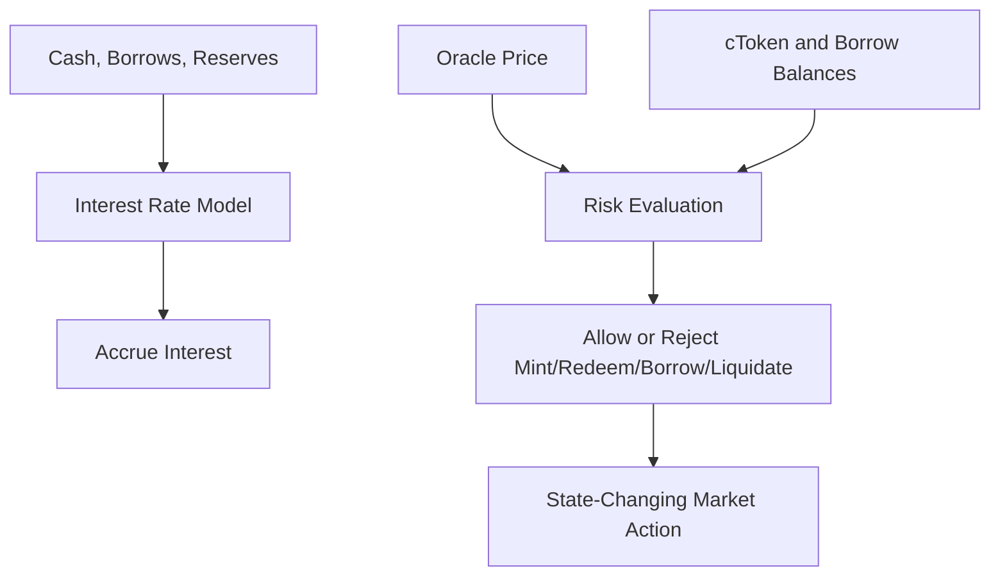

# DeFinTech: A Multi-Asset DeFi Lending Protocol with Perpetual Position and Liquidity-Aware Redemption Mechanisms

## 1. Introduction

DeFinTech is a decentralised application (DApp) for lending, borrowing, collateral management, and perpetual leveraged position management on Ethereum-compatible blockchains. The application allows users to supply assets such as ETH and ERC-20 tokens, use supplied assets as collateral, borrow other assets, monitor account health, and close positions by repaying debt and redeeming collateral. In addition to conventional lending functions, the project extends the lending model with position-level abstractions such as `openPosition`, `closePosition`, and position valuation, allowing users to reason about leveraged exposure more intuitively.

The application is important because lending is one of the core financial primitives in decentralised finance (DeFi). In traditional finance, borrowing and lending are usually mediated by banks, brokers, or centralised platforms. In DeFi, the same function can be implemented through transparent smart contracts, where collateral, debt, interest accrual, liquidations, and risk parameters are verifiable on-chain. This transparency is particularly valuable after failures of centralised crypto lenders, where users often had limited visibility into risk exposure and balance-sheet quality. A transparent on-chain protocol can show deposits, borrow balances, collateral factors, and liquidation states directly from contract data.

The target users of DeFinTech are retail DeFi users, liquidity providers, borrowers, and protocol operators who need transparent collateralised lending markets. The application is also suitable for testnet deployment and validation because it supports both mock price feeds and Chainlink-style oracle deployment. This makes it possible to test deterministic scenarios while preserving a migration path toward production-grade market data.

## 2. Background

### 2.1 DeFi Lending

Decentralised lending protocols enable users to deposit assets into liquidity pools and borrow against collateral without requiring a central intermediary. The model is normally overcollateralised: a borrower must supply collateral worth more than the value borrowed. This is necessary because anonymous blockchain users cannot be credit-scored in the same way as traditional borrowers. Instead, solvency is maintained through collateral ratios, health factors, liquidations, and price oracles.

Compound and Aave are two influential examples in this area. Compound's cToken model represents supplied assets through interest-bearing cTokens; users mint cTokens when supplying assets, redeem them to withdraw, and borrow assets when they have sufficient account liquidity. Compound documentation describes cTokens as the primary interface for minting, redeeming, borrowing, repaying, and liquidation, with cToken balances representing ownership of a market [1]. Aave uses a similar collateralised lending model but places particular emphasis on risk parameters such as loan-to-value, liquidation threshold, and health factor. Aave defines Health Factor as collateral value multiplied by liquidation threshold divided by borrow value; a value below 1 indicates liquidation risk [2].

These protocols show that DeFi lending is not merely a token exchange mechanism. It is a risk-managed credit system. A robust lending protocol must therefore include market-level configuration, collateral constraints, price feeds, liquidation incentives, and interest-rate mechanisms.

### 2.2 Market Need and Use Cases

The main use cases for DeFi lending are:

- earning yield by supplying idle assets;
- borrowing liquidity without selling collateral;
- building leveraged exposure, for example supplying ETH and borrowing a stablecoin or another volatile asset;
- short exposure, for example borrowing an asset and selling it externally;
- liquidation and arbitrage participation by third-party keepers or liquidators.

The need for such an application arises from the demand for open, non-custodial, programmable credit markets. Unlike centralised lending platforms, DeFi protocols publish their rules and balances on-chain. This does not remove risk, but it makes risk more observable. Aave's large market presence also indicates commercial viability: DefiLlama lists Aave as a major lending protocol with tens of billions of dollars in total value locked and substantial fee generation [3]. This suggests that lending protocols can generate revenue through interest spreads, reserve factors, liquidation penalties, and transaction-related fees.

### 2.3 Competitors and Related Work

The closest competitors and inspirations are:

- **Compound**: a cToken-based money market architecture with separate CEther and CErc20 markets [1].
- **Aave**: a multi-asset lending protocol using Health Factor, liquidation thresholds, and governance-controlled risk parameters [2].
- **MakerDAO / Spark-style systems**: collateral-backed credit systems that show how stable borrowing can be built from overcollateralisation.
- **DeFi Saver and similar portfolio tools**: interfaces that help users monitor and adjust positions.

DeFinTech differs from these protocols by combining a compact lending core with additional features requested by the project specification: perpetual position abstraction, dual redemption, emergency shutdown behaviour, and explicit test coverage for bank-run style liquidity mismatch.

### 2.4 Oracles and Price Reliability

Price data is central to any lending protocol. If ETH, WBTC, or a stablecoin is mispriced, the protocol may allow excessive borrowing or fail to liquidate unsafe accounts. Chainlink explains the oracle problem as the inability of smart contracts to natively access external data. Chainlink data feeds address this by aggregating data from multiple sources through independent oracle nodes, reducing single points of failure [4]. In DeFinTech, this principle is reflected by having two oracle modes:

- `MockPriceOracle` for deterministic testing and repeatable scenario validation;
- `ChainlinkPriceOracle` for production-style price feeds with stale-price checks and owner-controlled feed configuration.

## 3. Design Documentation

### 3.1 Design Approach

The system follows a modular architecture inspired by Compound and Aave. The core design choice is separation of concerns:

- cToken markets manage deposits, borrows, redemptions, repayments, reserves, and interest accrual.
- The Comptroller manages risk: listed markets, LTV, liquidation threshold, liquidation bonus, supply caps, borrow caps, account liquidity, and Health Factor.
- Interest rate strategy contracts calculate utilization-sensitive borrow rates.
- Oracle contracts provide asset prices.
- The Advanced Lending Protocol wraps lower-level borrowing and redemption actions into higher-level user operations.
- The frontend provides wallet connection, market views, supply/borrow pages, dashboard, and transaction records.

This approach was chosen because lending protocols are naturally multi-contract systems. A monolithic contract would be harder to audit, test, and upgrade. By separating market accounting, risk evaluation, pricing, and user-level abstractions, each component can be reasoned about independently.

### 3.2 Overall Architecture



### 3.3 Main Smart Contracts

| Contract | Responsibility |
| --- | --- |
| `CTokenBase` | Shared cToken accounting: exchange rate, borrow balances, interest accrual, mint, redeem, borrow, repay, liquidation helpers |
| `CEth` | Native ETH market implementation |
| `CErc20` | ERC-20 market implementation |
| `Comptroller` | Multi-market risk checks, LTV, Health Factor, liquidation threshold, caps, pause controls |
| `JumpRateInterestStrategy` | Utilization-based dynamic interest model |
| `MockPriceOracle` | Test oracle with manually set prices and price history |
| `ChainlinkPriceOracle` | Production-style oracle using Chainlink-compatible feeds |
| `AdvancedLendingProtocol` | Perpetual positions, instant redemption, scheduled redemption, emergency shutdown |
| `CrossMarketLeverageRouter` | Router for cross-market leverage and frontend-friendly operations |

### 3.4 Ideal User Flow

1. The user connects a wallet on Sepolia.
2. The frontend reads supported markets and displays prices, APYs, utilization, caps, and user balances.
3. The user supplies ETH or ERC-20 assets.
4. The user enables collateral by entering the market.
5. The user borrows another asset if LTV and Health Factor checks pass.
6. The user may open a perpetual position through `openPosition`, which supplies collateral and borrows a target asset.
7. The user monitors position value and PnL.
8. The user closes the position through `closePosition`, repaying debt and redeeming collateral.
9. If the user withdraws liquidity, they can use instant redemption or scheduled redemption.
10. If a position becomes unsafe, a liquidator can repay part of the debt and seize collateral with a liquidation bonus.

### 3.5 Use Cases



### 3.6 Sequence: Opening and Closing a Perpetual Position



### 3.7 Sequence: Scheduled Redemption with Pro-Rata Allocation



This design addresses bank-run behaviour. If liquidity is insufficient, the first user does not drain all remaining liquidity. Instead, scheduled redemptions are allocated proportionally.

### 3.8 State and Data Flow



### 3.9 User Interface Design

The frontend is implemented with Next.js and provides:

- **Dashboard**: portfolio summary, total supplied, total borrowed, net APY, Health Factor, positions, and transaction history.
- **Markets**: list of all supported markets, market-level risk and liquidity information, price chart, and user holding price.
- **Supply**: asset selection, wallet balance, amount input, supply and redeem modes.
- **Borrow**: borrowable markets, borrowing limits, borrow and repay flows.

The interface is intentionally operational rather than decorative. Lending interfaces require clarity, predictable controls, and fast scanning of risk information. For this reason, the UI uses compact market cards, clear numerical labels, and direct action buttons.

## 4. Project Execution

### 4.1 Implementation Overview

The project was implemented as a Hardhat smart contract system with a Next.js frontend. The contracts are written in Solidity 0.8.x and tested through Hardhat. The frontend uses ethers.js to read protocol state and submit wallet transactions.

The implementation evolved from a simplified Compound-style model into a more advanced lending system. The core cToken model handles supply, redeem, borrow, repay, and liquidation. The Comptroller adds Aave-style risk controls. The Advanced Lending Protocol adds higher-level position and redemption features.

### 4.2 Core Code Analysis

#### 4.2.1 Multi-Asset Market Control

The `Comptroller` stores a `Market` struct for each cToken:

```solidity
struct Market {
    bool isListed;
    uint256 ltvMantissa;
    uint256 liquidationThresholdMantissa;
    uint256 liquidationBonusMantissa;
    uint256 supplyCap;
    uint256 borrowCap;
}
```

This design allows each market to have independent risk parameters. For example, WBTC can have a lower LTV than USDC because it is more volatile, while stablecoin markets may be configured with different caps and thresholds.

Borrowing is controlled through `borrowAllowed`, which checks market listing, pause state, borrow caps, and hypothetical account liquidity. Redemptions are checked through `redeemAllowed`, preventing users from withdrawing collateral in a way that would make their account undercollateralised.

#### 4.2.2 Health Factor and Liquidation

Health Factor is calculated as:

```text
sum(collateral value * liquidation threshold) / sum(borrow value)
```

This follows the principle used by Aave, where accounts below a Health Factor of 1 are eligible for liquidation [2]. In the implementation, `liquidateBorrowAllowed` checks that the borrower is unsafe and that the repay amount does not exceed the close factor. Collateral seizure is calculated using borrowed asset price, collateral price, exchange rate, and liquidation bonus.

#### 4.2.3 Jump Rate Model

`JumpRateInterestStrategy` calculates borrow rates from utilization:

```text
utilization = totalBorrows / (cash + totalBorrows - totalReserves)
```

Below the kink, rates rise gradually. Above the kink, the jump multiplier increases the cost of borrowing more sharply. This discourages excessive utilization and helps preserve market liquidity.

#### 4.2.4 Perpetual Position Abstraction

`AdvancedLendingProtocol` introduces:

- `openPosition`
- `closePosition`
- `getPositionValue`

A position records owner, collateral market, debt market, collateral amount, debt principal, entry prices, and open/closed state. There is no expiry timestamp, so the position is perpetual. The user can close it at any time by repaying debt and redeeming collateral, subject to market liquidity and account safety.

This abstraction makes the system easier to understand from a user perspective. Rather than thinking only in separate supply and borrow operations, a user can view a combined leveraged position.

#### 4.2.5 Dual Redemption

The protocol implements two redemption paths:

- **Instant redemption**: executes immediately if market cash is sufficient. It can charge higher fees when liquidity would become stressed.
- **Scheduled redemption**: queues user requests into a batch and processes them after a delay. If liquidity is insufficient, the executable amount is distributed pro-rata.

This design directly addresses liquidity mismatch. Instant withdrawals are useful in normal conditions, while scheduled withdrawals give the protocol a fairer mechanism during liquidity stress.

#### 4.2.6 Emergency Shutdown

Emergency shutdown prevents new risk creation by blocking new perpetual positions and disabling instant redemption. However, users can still close existing positions. This balances systemic protection with user exit rights.

### 4.3 Testing Strategy

Testing followed a scenario-driven methodology. Instead of only checking individual functions, the suite simulates realistic protocol states:

- users supply assets;
- users borrow within and beyond LTV;
- prices move and cause liquidation;
- markets are paused;
- redemption requests compete for limited liquidity;
- emergency shutdown blocks new positions while allowing close operations.

The test suite is divided into focused files:

| Test file | Main purpose |
| --- | --- |
| `test/AaveFeatures.ts` | Verifies LTV borrow limits, Health Factor liquidation, supply caps, borrow caps, and market pause behaviour |
| `test/AdvancedLendingProtocol.ts` | Verifies perpetual position opening/closing, PnL valuation, instant redemption, scheduled redemption, pro-rata execution, early-exit penalty, and emergency shutdown |
| `test/ExtendedMarketsAndConfig.ts` | Verifies WBTC/USDT multi-asset behaviour, independent decimals, Chainlink oracle protections, jump rate model behaviour, and deployment configuration |
| `test/MoreFlows.ts` | Verifies ETH and ERC-20 supply, redeem, borrow, repay, and liquidation flows |
| `test/OracleImplementations.ts` | Verifies mock oracle and Chainlink oracle behaviour |
| `test/SecurityEdgeCases.ts` | Verifies access control, zero amount rejection, oracle zero-price safety, invalid router rejection, and undercollateralised redeem prevention |

### 4.4 How to Test

The project can be tested locally from the project root directory. The tests do not require Sepolia transactions because Hardhat runs them on a local simulated blockchain.

1. Open a terminal in the project root:

```bash
cd "C:\Users\tangc\Desktop\FTGP2526_Group13_DeFinTech13-frontend-integration - 副本"
```

2. Install dependencies if needed:

```bash
npm install
```

3. Run the full smart contract test suite:

```bash
npm test
```

This command runs:

```bash
hardhat test
```

Expected result:

```text
Solidity tests: 3 passing
TypeScript / Node tests: 28 passing
Failed: 0
```

4. Generate a persistent raw test result file:

```bash
npm run test:report
```

This writes the complete Hardhat output to:

```text
test-results/hardhat-test-results.txt
```

5. Build the frontend to verify TypeScript and Next.js compilation:

```bash
cd frontend
npm install
npm run build
```

Expected result:

```text
Compiled successfully
```

6. Optional deployment tests:

The project provides two deployment paths:

```bash
npm run deploy:mock
```

This deploys the protocol with `MockPriceOracle`, where asset prices are manually configured and repeatable.

```bash
npm run deploy:chainlink
```

This deploys the protocol with `ChainlinkPriceOracle`, where market prices are read from Chainlink-compatible feeds.

After either deployment, the script updates:

```text
frontend/.env.local
```

The frontend can then be run with:

```bash
cd frontend
npm run dev
```

The latest test run passed:

```text
Solidity tests: 3 passing
TypeScript / Node tests: 28 passing
Failed: 0
```

The raw output is saved in:

```text
test-results/hardhat-test-results.txt
```

The structured test summary is saved in:

```text
TEST_REPORT.md
```

### 4.5 Final UI Showcase

The final UI includes:

- a Dashboard page for account overview and transaction records;
- a Markets page with price trend chart and market cards;
- Supply and Borrow pages with asset tabs and wallet-state information;
- Sepolia wallet connection indicator;
- transaction feedback through toast notifications.

Screenshots should be inserted in the appendix:

- Dashboard screenshot;
- Markets screenshot with price chart;
- Supply page screenshot;
- Borrow page screenshot;
- Transaction history screenshot.

### 4.6 User Manual

#### Connect Wallet

1. Open the deployed website.
2. Connect MetaMask.
3. Switch to Sepolia if prompted.

#### Supply Assets

1. Open the Supply page.
2. Select a market such as ETH, USDC, DAI, WBTC, WETH, or USDT.
3. Enter an amount.
4. For ERC-20 assets, approve the token if required.
5. Submit the supply transaction.

#### Enable Collateral

1. Supply an asset.
2. Enter the relevant market as collateral.
3. Confirm that Dashboard shows a non-zero supply position.

#### Borrow Assets

1. Open the Borrow page.
2. Select an asset.
3. Enter an amount below the available borrowing capacity.
4. Submit the borrow transaction.

#### Open and Close Perpetual Position

1. Select collateral and debt asset.
2. Call `openPosition` through the protocol interface or integrated frontend action.
3. Monitor PnL through position valuation.
4. Close the position by repaying debt and redeeming collateral.

#### Redeem

1. Use instant redemption for immediate withdrawal when liquidity is available.
2. Use scheduled redemption when liquidity is stressed or a more reliable withdrawal route is needed.
3. Avoid cancelling scheduled redemption early unless willing to pay the penalty.

## 5. Critical Evaluation

### 5.1 Security Evaluation

The system includes multiple security controls:

- admin-only market configuration;
- admin-only Chainlink feed setting;
- zero-price rejection;
- stale-price rejection;
- supply and borrow caps;
- pause controls;
- Health Factor liquidation checks;
- close factor limits in liquidation;
- reentrancy guards in market operations and advanced redemption logic.

However, the prototype still has limitations. It has not undergone professional audit, formal verification, or mainnet stress testing. The advanced redemption contract is intentionally simplified and should be reviewed carefully before any production deployment. In particular, scheduled redemption batching and partial execution require careful accounting under repeated liquidity changes.

### 5.2 Gas and Performance Considerations

The most gas-intensive operations are those involving multiple contracts:

- opening positions, because it supplies collateral, enters markets, borrows, and stores position data;
- liquidation, because it accrues interest on two markets and transfers seized collateral;
- scheduled redemption processing, because it redeems batch liquidity and later supports claims.

Read performance is also relevant for the frontend. Dashboard and Markets pages perform several `eth_call` reads per market: total supply, total borrows, reserves, cash, exchange rate, price, risk parameters, and user-specific balances. As the number of supported markets increases, RPC reliability becomes more important. The frontend therefore tolerates partial market failures and keeps transaction history queries small.

### 5.3 Comparison with Existing Protocols

Compared with Compound, DeFinTech adopts a similar market-token model but adds Aave-style Health Factor, liquidation threshold, and more explicit market caps. Compared with Aave, it is much simpler and lacks production-grade governance, eMode, isolation mode, flash loans, and mature liquidation infrastructure. Its strength is architectural clarity: the implementation isolates the essential moving parts of a multi-asset lending system while adding project-specific mechanisms such as scheduled redemption and perpetual position abstraction.

### 5.4 Limitations

Current limitations include:

- no audited production deployment;
- limited frontend integration for advanced position operations;
- scheduled redemption queue is simplified;
- no automated keeper network for liquidation;
- mock WBTC and USDT are used on Sepolia for easier testing;
- Chainlink feed availability depends on testnet feed support.

## 6. Conclusion

This project demonstrates a multi-asset DeFi lending protocol with risk-managed borrowing, dynamic interest rates, liquidation, dual redemption, emergency shutdown, and perpetual position abstractions. The design builds on established ideas from Compound and Aave while extending them toward liquidity-aware redemption and position-level user experience.

The main technical achievement is the integration of multiple risk layers into a coherent system: LTV prevents excessive borrowing, Health Factor enables liquidation, market caps reduce systemic concentration, jump rates react to utilization, and oracle checks prevent unsafe pricing. The test suite confirms the major required behaviours across normal flows and adverse conditions.

Future work should focus on deeper frontend integration for advanced positions, gas profiling, formal verification, production-grade oracle configuration, governance controls, and a keeper/liquidator monitoring system.

## 7. References

[1] Compound Finance, "Compound v2 Docs: cTokens." Available: https://docs.compound.finance/v2/ctokens

[2] Aave, "Health Factor & Liquidations." Available: https://aave.com/help/borrowing/liquidations

[3] DefiLlama, "Aave Protocol Metrics." Available: https://defillama.com/protocol/Aave

[4] Chainlink, "What Are Decentralized Data Feeds?" Available: https://chain.link/article/what-are-decentralized-data-feeds

[5] Compound Finance, "Compound Protocol GitHub Repository." Available: https://github.com/compound-finance/compound-protocol

[6] Chainlink, "The Industry-Standard Oracle Platform." Available: https://chain.link/

## 8. Appendix

### A. Sepolia Smart Contract Addresses

Current addresses from `frontend/.env.local`:

| Contract | Address | Etherscan Sepolia |
| --- | --- | --- |
| Oracle | `0xFD887BFaFCAa3c231D67617E89130121b93A1736` | https://sepolia.etherscan.io/address/0xFD887BFaFCAa3c231D67617E89130121b93A1736 |
| Interest Strategy | `0x42AC948d64A2613D79B6Ed2AB8141c82e1563a30` | https://sepolia.etherscan.io/address/0x42AC948d64A2613D79B6Ed2AB8141c82e1563a30 |
| Comptroller | `0xaEd0f5E64aAeED1A6AB306014061901dF82E7Aa7` | https://sepolia.etherscan.io/address/0xaEd0f5E64aAeED1A6AB306014061901dF82E7Aa7 |
| cETH | `0x5090B7bA37E0B05ba0d178370988B881b22cd221` | https://sepolia.etherscan.io/address/0x5090B7bA37E0B05ba0d178370988B881b22cd221 |
| cUSDC | `0x5566c1BC96208CE87c7a8AC3ADeA830d68E5eCb8` | https://sepolia.etherscan.io/address/0x5566c1BC96208CE87c7a8AC3ADeA830d68E5eCb8 |
| cDAI | `0xD86Bc85fb09Aa2f7CC33F02E01C76D9165C9972A` | https://sepolia.etherscan.io/address/0xD86Bc85fb09Aa2f7CC33F02E01C76D9165C9972A |
| Router | `0xa99B5742FA4e8C3264265B41e25B50830A6b1d61` | https://sepolia.etherscan.io/address/0xa99B5742FA4e8C3264265B41e25B50830A6b1d61 |

After deploying the expanded market version, also add:

| Contract | Address |
| --- | --- |
| cWBTC | To be inserted after `npm run deploy:mock` or `npm run deploy:chainlink` |
| cWETH | To be inserted after deployment |
| cUSDT | To be inserted after deployment |
| Mock WBTC | To be inserted after deployment |
| Mock USDT | To be inserted after deployment |

### B. Deployed Website

Website link: `TO BE INSERTED`

### C. Deploy and Test Transaction Hashes

| Transaction | Hash | Explanation |
| --- | --- | --- |
| Deployment transaction(s) | `TO BE INSERTED` | Deployment of protocol contracts |
| Example supply transaction | `TO BE INSERTED` | User supplied collateral |
| Example borrow transaction | `TO BE INSERTED` | User borrowed against collateral |
| Example liquidation transaction | `TO BE INSERTED` | Liquidator repaid unsafe debt and seized collateral |

### D. GitHub Repository

Repository link: `TO BE INSERTED`

### E. Equity Share Distribution

| Member | Contribution Share |
| --- | --- |
| Member 1 | `TO BE INSERTED` |
| Member 2 | `TO BE INSERTED` |
| Member 3 | `TO BE INSERTED` |
| Member 4 | `TO BE INSERTED` |

### F. GitHub Insights Screenshot

Insert GitHub Insights contributor screenshot here.

### G. JIRA Board Screenshots

Insert required JIRA board screenshots here.

### H. Individual Reflection Essays

Insert each group member's individual reflection essay here.

### I. Sprint Reports

Insert sprint reports in chronological order.

### J. Solidity and Test Code

The complete Solidity and testing code should be included in the final submission appendix or linked from the GitHub repository. Key files include:

- `contracts/Comptroller.sol`
- `contracts/CTokenBase.sol`
- `contracts/CEth.sol`
- `contracts/CErc20.sol`
- `contracts/JumpRateInterestStrategy.sol`
- `contracts/MockPriceOracle.sol`
- `contracts/ChainlinkPriceOracle.sol`
- `contracts/AdvancedLendingProtocol.sol`
- `test/AaveFeatures.ts`
- `test/AdvancedLendingProtocol.ts`
- `test/ExtendedMarketsAndConfig.ts`
- `test/OracleImplementations.ts`
- `test/SecurityEdgeCases.ts`

### K. Relevant Frontend Code

Relevant frontend files include:

- `frontend/app/dashboard/page.tsx`
- `frontend/app/markets/page.tsx`
- `frontend/app/supply/page.tsx`
- `frontend/app/borrow/page.tsx`
- `frontend/components/MarketPriceChart.tsx`
- `frontend/components/TransactionHistoryPanel.tsx`
- `frontend/lib/protocol.ts`
- `frontend/lib/contracts.ts`
